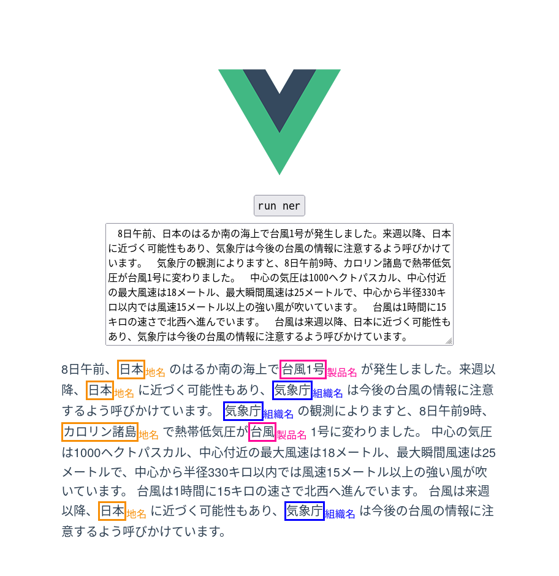

# NER-Demo
日本語固有表現抽出のデモを実行できます．  


## 環境
Dockerとdocker-composeを利用しています．GPUが必要になります．  
固有表現抽出を行う事前学習済みモデルとしてBERTをしています．

## 実行
```
docker-compose up -d
```
モデルの学習を行うために以下のデータセットのダウンロードが必要になります．  
[https://github.com/stockmarkteam/ner-wikipedia-dataset](https://github.com/stockmarkteam/ner-wikipedia-dataset)  
backendコンテナ内で作業してください．

```
docker exec -it backend /bin/bash
wget -P dataset/ https://raw.githubusercontent.com/stockmarkteam/ner-wikipedia-dataset/main/ner.json
python3 train.py
```
学習が終わればinference.pyの72行目を適宜使用するモデル名に書き換えてください．  
モデルが用意できればコンテナの再起動で実行されます

```
docker-compose restart
```
デフォルトでは5500番ポートを使用しています．  
[http://実行してるパソコンのIP:5500/](http://実行してるパソコンのIP:5500/)  

## フロントのビルド
フロントエンドに変更を加える場合はfrontendコンテナの中で作業してください
### ビルド
```
npm run build
```